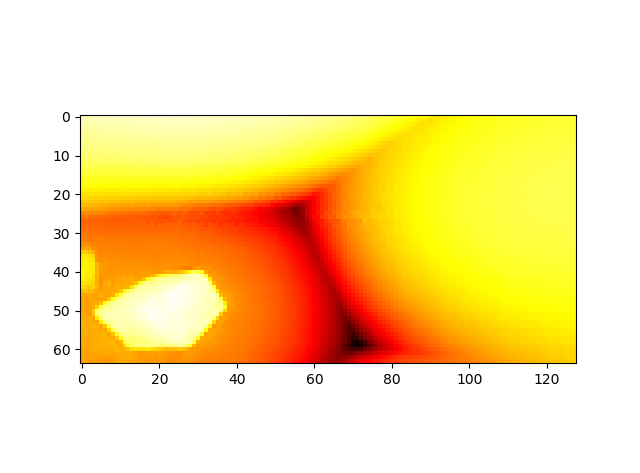

# DispNet_Keras
Implementation of DispNet in Keras

The method is suggested by Nikolaus Mayer et al.. Here is the DispNet paper: <a href="https://arxiv.org/abs/1512.02134">https://arxiv.org/abs/1512.02134</a>

Download the dataset from the link below:

<a href="https://github.com/LouisFoucard/DepthMap_dataset">DepthMap_dataset</a>

Sample stereo images:

Ground truth:

Here is the prediction after 200 epochs:

